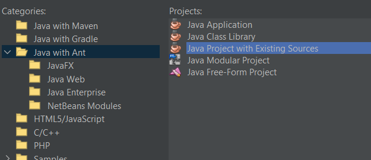
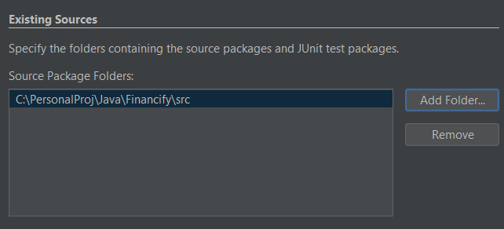

# Financify
 Finance tracker in Java

## How to use with NetBeans

**Create a new Java Project with Existing Source**

**Add the Financify/src folder in the Source Packages Folder**

**Click finish**

### Adding the appropriate library

1. Right click on project
2. Go to Libraries
3. Click the plus button on Classpath
4. Click "Add JAR/folder"
5. Add json-simple 1.1.1.jar in `Financify/lib`

Just click on Continue and OK and you're done!